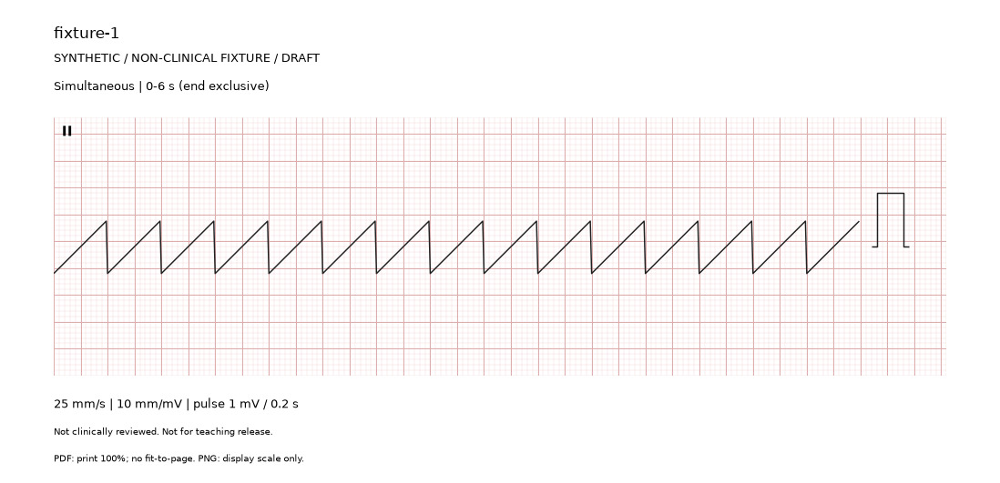
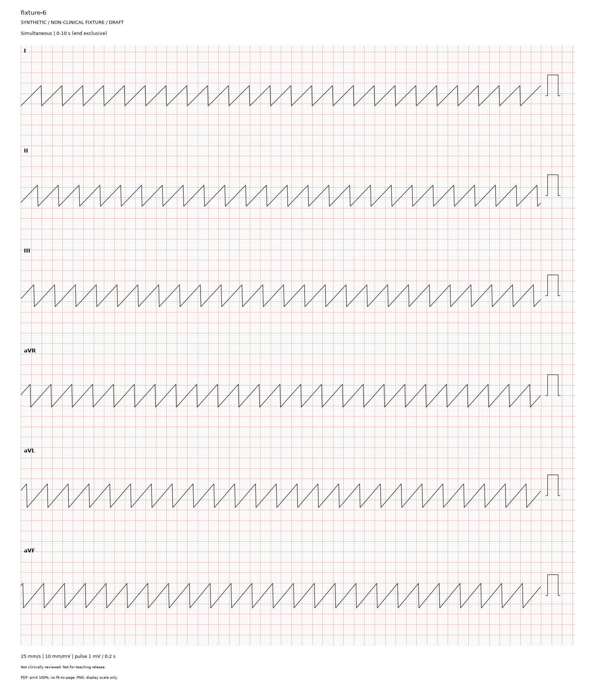
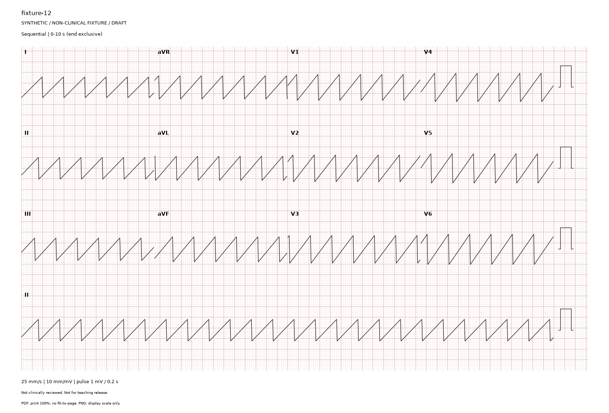

# ECG Strip Generator

ECG Strip Generator is a standalone tool-development subproject of ECG Course.

## Status

Milestone 1 provides validated draft PDF/PNG rendering for one through six and twelve
leads, with reproducible output and a provenance manifest. Milestone 2 adds a
nine-source registry, attribution notices, explicit subset downloads and offline
raw-byte auditing. Real waveform extraction and reviewed teaching packages
remain future milestones. See the
[approved execution plan](docs/plans/2026-09-05-ecg-strip-generator-revised-execution-plan.md).

This tool is for personal, non-commercial education only, not patient care,
diagnosis, formal institutional operations, or paid courses.

## Setup

Install uv separately, then run from this repository:

```console
uv sync --locked --python 3.12
uv run --locked ecg-strip --version
uv run --locked ecg-strip doctor
```

uv uses an isolated `.venv` and Python 3.12; do not install these dependencies
into system Python. `uv.lock` pins the resolved environment. Setup downloads
Python if needed and package dependencies, but no ECG datasets.

`doctor` reports runtime identity only. It does not certify dataset availability,
clinical correctness, or rendering calibration.

## Audit or acquire source files

From the repository root:

```console
uv run --locked ecg-strip datasets audit
uv run --locked ecg-strip datasets attribution nsrdb --changes "None; original source bytes."
uv run --locked ecg-strip datasets fetch nsrdb --file RECORDS
```

`audit` is offline and creates no directories. `fetch` downloads only the
explicit file selection plus the official checksum list. Repeat `--file` to
acquire related files as one atomic bundle. Downloads remain under ignored
`data/`; a verified subset is not a complete or clinically validated dataset.
See [source handling](docs/data-sources.md) for the storage contract and limits.

## Try a non-clinical draft

```console
uv run --locked python examples/make_fixture.py --leads 12 --output output/fixture-12.json
uv run --locked ecg-strip render output/fixture-12.json --output output/draft-12
```

Use a new output path for each run. The supplied ramp/triangle signals test the
renderer and do not represent diagnostic rhythms. Twelve-lead output uses three
continuous 10-second rows plus a full 10-second Lead II rhythm strip; calibration
appears once per row at the right edge by default. See
[rendering and calibration](docs/rendering-and-calibration.md) for the request
format, supported settings, output files and physical-calibration limits.

## Preview gallery

These are non-clinical ramp/triangle fixtures for checking layout and scale,
not diagnostic ECGs. Click an image to inspect its full resolution.

### One lead — continuous 6 seconds



### Six leads — continuous 10 seconds per row



### Twelve leads — 3 × 4 plus continuous 10-second Lead II



These owner-approved public previews are stored in `docs/previews/`; ordinary
local generated output remains ignored. Reproduce with `examples/make_fixture.py`
using `--leads 1 --duration 6`, `--leads 6 --duration 10`, or
`--leads 12 --duration 10`, then render each request with `ecg-strip render`.

## Development checks

```console
uv run --locked python -c "import ecg_strip_generator"
uv run --locked python -m pytest tests
uv run --locked ruff check .
uv run --locked ruff format --check .
```

Fast tests require no external datasets. Later dataset tests must never download
data implicitly.

## Documentation

- [Architecture](docs/architecture.md)
- [Clinical safety](docs/clinical-safety.md)
- [Data sources](docs/data-sources.md)
- [Rendering and calibration](docs/rendering-and-calibration.md)

## Language

English is the primary project language. zh-HK wording may be added when it improves local usability.

## Development workflow

- The current workflow uses `main` for single-developer work.
- Keep changes focused and run relevant checks before committing.
- Verified milestones within the approved plan may be committed locally automatically.
- Every remote push still requires separate project-owner approval.

## Privacy and publishing

This is a public repository. Do not add patient-identifiable information, student names, exam answers, secrets, API keys, tokens, credentials, or unreviewed private teaching material.

Original source files must be preserved, and their provenance must remain clear. Do not rename, move, or delete original source files without explicit approval.

Local data (`data/`), generated output (`output/`), environments, and caches are
ignored by Git. Do not commit raw recordings or private answer keys.

## Code licence

No project code licence has been selected or granted. Do not infer a licence
from the public repository or the personal-use scope. Dataset and dependency
licences are separate and retain their own terms.

## Deployment

No deployment platform is configured yet.

## Project dashboard

Project progress is tracked in the owner's Obsidian project dashboard.
